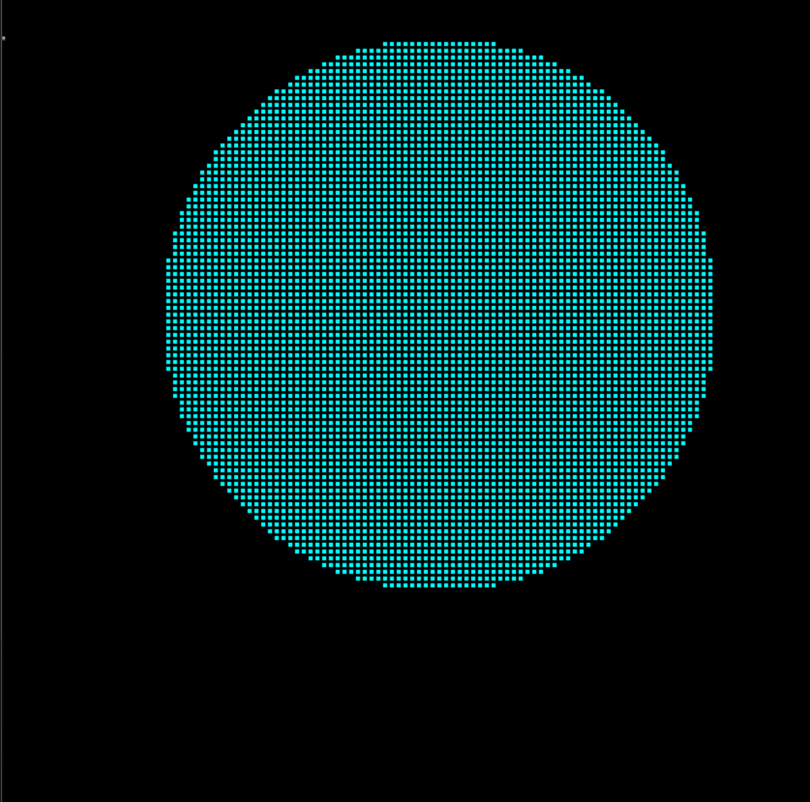
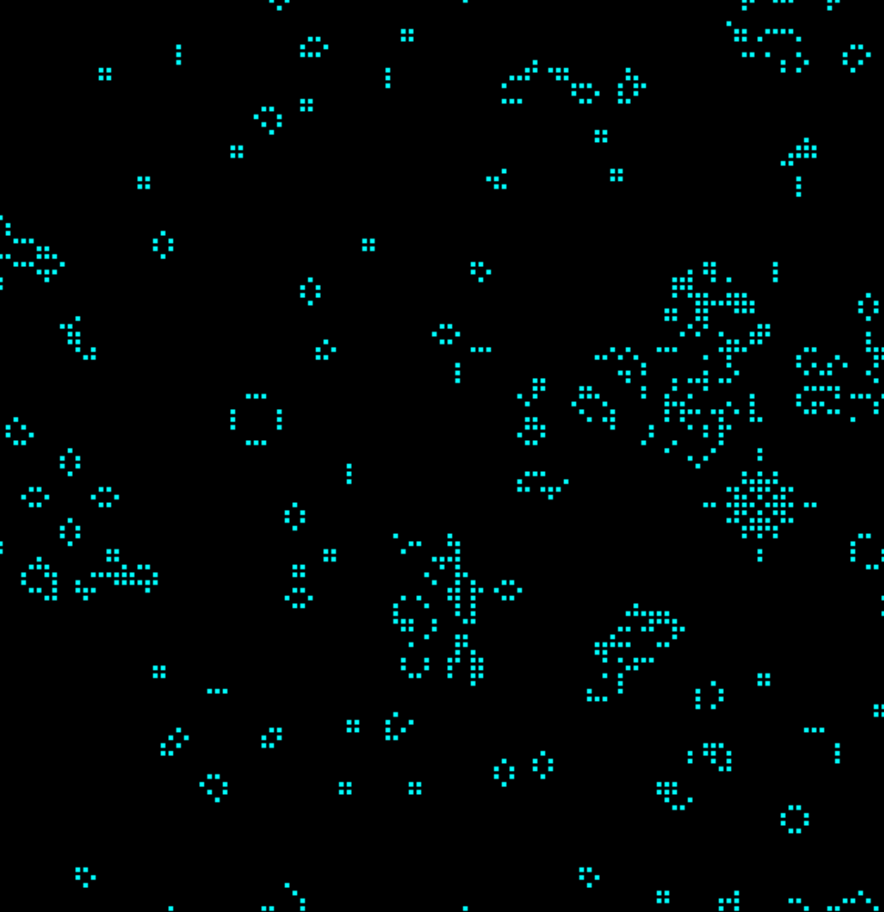

# Виртуальный процессор
Шелонин Арсений, 1 курс ФРКТ МФТИ

## Сборка и запуск
*Программа написана для системы Windows.*

### Сборка
1. Клонируйте репозиторий
```bash
$ git clone https://github.com/71frukt/SPU.git
```

2. Соберите проект

```bash
$ make
```

### Запуск

1. Перейдите в папку `build`
```bash
$ cd build
```

2. Запустите ассемблер
```bash
$ compiler.exe <code_file> <binary_file> 
```

3. Запустите процессор
```bash
$ spu.exe <binary_file>
```


## Описание проекта
Проект представляет собой симулятор процессора, реализующий работу с регистрами и оперативной памятью, используемой в роли видеопамяти. 

Программа состоит из двух компонентов - ассемблер и процессор. Ассемблер переводит ваш код на машинный язык, а процессор читает машинный код и выполняет программу. Подробнее про их работу речь пойдёт ниже.

## 1. Ассемблер
Ассемблер - программа, которая переводит написанный код в двоичный. Каждая инструкция однозначно кодируется 16 битами: первые 13 бит выделяются для уникального кода инструкция, последние 3 управляют работой с памятью в инструкциях, взаимодействующих со стеком.

Также ассемблер считывает объявления меток и переводит их имена в абсолютные адреса.

## 2. Процессор

Процессор выполняет все вычисления и реализует работу со стеком и оперативной памятью. Он считывает из файла бинарный код программы и выполняет его. 

Для перехода между инструкциями в структуре процессора лежит специальное поле `ip`, которое отвечает за номер текущей инструкции.

Процессор обладает некоторым количеством регистров. Это количество определяется константой `REGISTERS_NUM` в файле `src/spu.h`. 


## Реализованные инструкции

_Полный список инструкций находится в файле `commands.h`_

### Инструкции работы со стеком

Инструкции `push` и `pop` работают со стеком. `push` кладёт в стек 4-байтное число, являющееся константой или значением регистра, или лежащее в симуляторе оперативной памяти.

_Здесь `IMM` - некоторая константа, `REG` - некоторый регистр._

|   Инструкция      |  Действие
|-------------------|------------
|`push IMM`         | кладет в стек IMM
|`push REG`         | кладет в стек значение REG
|`push [IMM]`       | берет из памяти по адресу IMM значение и кладёт в стек
|`push [REG]`       | берет из памяти по адресу, лежащему в REG, значение и кладёт в стек
|`push [REG + IMM]` | берет из памяти по адресу, равному значению REG + IMM, значение и кладёт в стек

В моей реализации ассемблера команда `push` имеет код 1. Чтобы наглядно продемонстрировать принцип кодирования, приведу пример для инструкций, которые кодируются 6 битами:

| Инструкция      | Use RAM    | Use register | Use constant | Код инструкции | 
|-----------------|------------|--------------|--------------|----------------|
| `push 5`        |      0     |     0        |       1      |  `001 001`     |
| `push AX`       |      0     |     1        |       0      |  `010 001`     |
| `push [5]`      |      1     |     0        |       1      |  `101 001`     |
| `push [AX]`     |      1     |     1        |       0      |  `110 001`     |
| `push [AX + 5]` |      1     |     1        |       1      |  `111 001`     |


### Математические операции

Все математические операции работают по одному принципу. Они берут аргументы из стека, вычисляют результат операции и сохраняют его в стек. Покажу псевдокодом, что происходит при вызове инструкции ***\<op>***.

**Бинарная операция:** 
```C
    StackElem_t arg1 = 0;
    StackElem_t arg2  = 0;

    Pop(&arg2);
    Pop(&arg1);

    Push(arg1 <op> arg2);
```

**Унарная:**
```C
    StackElem_t arg = 0;
    Pop(&arg);

    arg = <op>(arg);

    Push(arg);
```

### Безусловные и условные переходы

Для безусловного перехода на метку используется команда `JMP`. Она приравнивает переменной `ip` значение своего аргумента.

Инструкции условного перехода забирают из стека два значения в обратном порядке, сравнивают, и делают переход в зависимости от условия. Семантически условие определяется так:

|   |       |
|---|-------|
`A` - больше
`B` - меньше
`E` - равно

Например, псевдокод инструкции JAE:
```C
    StkElmsCmpVal cmp = StkTwoLastElmsCmp(data_stk);    // сравнить два элемента стека

    if (cmp == A || cmp == E)
        goto JUMP_MARK;                                 // сделать переход
    else
        cmd->ip += 2;                                   // или пойти дальше
```


### Инструкции для работы с функциями

Для работы с функциями используются `CALL` и `RET`. 

`CALL` кладёт в стек адрес следующей инструкции и присваивает переменной `ip` адрес, указанный после команды. 

`RET` забирает из стека лежащий там адрес возврата и присваивает `ip` его значение. 

Благодаря такой структуре вызова функций, виртуальный процессор поддерживает вложенные вызовы функций и рекурсию.

### Подробнее об оперативной памяти

Оперативная память представляет собой массив чисел, тип которых определяется строкой в файле `stack/leb/stack.h`:

```C
typedef int StackElem_t;
```

В моей программе оперативная память используется в роли видеопамяти, где каждая ячейка памяти отвечает за то, нужно ли рисовать пиксель или нет. Размеры памяти определяются константами `RAM_SIZE_X` и `RAM_SIZE_Y` в файле `src/spu.h`. 

## Реализованные программы

Для демонстрации работы процессора я реализовал четыре программы - расчёт решений квадратного уравнения, рекурсивный расчёт факториала числа, и программы, использующие видеопамять - отрисовка окружности и игра "Жизнь".

<details>
<summary>Пример рекурсивного расчёта факториала</summary>

```asm
SPU_IN      ;считать число из консоли
POP BX      ;положить его в BX

PUSH 1
POP CX      ;счётчик = 1

PUSH 1      
CALL Factorial:

SPU_OUT     ;напечатать результат
HLT         ;конец программы

Factorial:
PUSH CX
PUSH BX

JAE END_OF_REC:
PUSH CX
SPU_OUT
PUSH CX
PUSH 1
ADD         ; счётчик ++
POP CX

PUSH CX     
MUL         ; умножить на предыдущее значение

CALL Factorial:     ; рекурсивный вызов, принимающий как аргумент полученное произведение

END_OF_REC:         
RET
```

</details>

Эта программа демонстрирует возможности использования рекурсивного вызова функций и базовый принципе работы процессора. 


## Рисование окружности

<div style="width: 50%; margin: 0 auto;">
  
</div>

Эта программа проходит циклом по всем пикселям, рассчитывая расстояние от каждого до центра. Если расстояние меньше или равно радиусу, пиксель окрашивается цветом.

Например, вот функция из кода, которая рассчитывает расстояние от ячейки с номером, лежащим в `BX`, до центра:

<details>
<summary>Фрагмент файла build/txts/run_circle.asm</summary>

```asm
PushCenterDist:
                PUSH BX
                CALL RAM_SIZE_X:
                MOD

                PUSH CX
                CALL RAM_SIZE_X:
                MOD
            SUB

                PUSH BX
                CALL RAM_SIZE_X:
                MOD

                PUSH CX
                CALL RAM_SIZE_X:
                MOD
            SUB
        MUL
        

                PUSH BX
                CALL RAM_SIZE_X:
                DIV

                PUSH CX
                CALL RAM_SIZE_X:
                DIV
            SUB

                PUSH BX
                CALL RAM_SIZE_X:
                DIV

                PUSH CX
                CALL RAM_SIZE_X:
                DIV
            SUB
        MUL
    ADD

    SQRT
RET
```

</details>


## Игра "Жизнь"

Эта программа реализует правила известной игры "Жизнь". Для рисования кадров используется графическая библиотека `TXLib`, но все другие расчёты производятся внутри. 

### Правила

* В пустой (мёртвой) клетке, с которой соседствуют три живые клетки, зарождается жизнь
* Если у живой клетки есть две или три живые соседки, то эта клетка продолжает жить
* В противном случае (если живых соседей меньше двух или больше трёх) клетка умирает («от одиночества» или «от перенаселённости»).

Программа пробегается циклом по всем клеткам, и для каждой считает количество соседей (поле замкнуто относительно краёв). В результате становится ясно, выживает клетка или нет. Её новое состояние записывается в теневую область памяти - копию основной. Это необходимо, т.к. если сразу убить или зародить жизнь в клетке, то для соседних клеток с учётом этой неправильно рассчитается количество соседей.

По окончании цикла в основную память копируется теневая, и происходит отрисовка кадра.  

<div style="width: 80%; margin: 0 auto;">
  
</div>

В игре можно увидеть различные фигуры - ульи, караваи, ладьи, семафоры и глайдеры, что свидетельствует о правильном алгоритме. Исходиник находится в `build/txts/life.asm`.


---
Итак, в результате работы был написан виртуальный процессор, симулирующий работу настоящего и поддерживающий базовый набор инструкций, достаточных для написания алгоритмов математических расчётов и небольших игр.